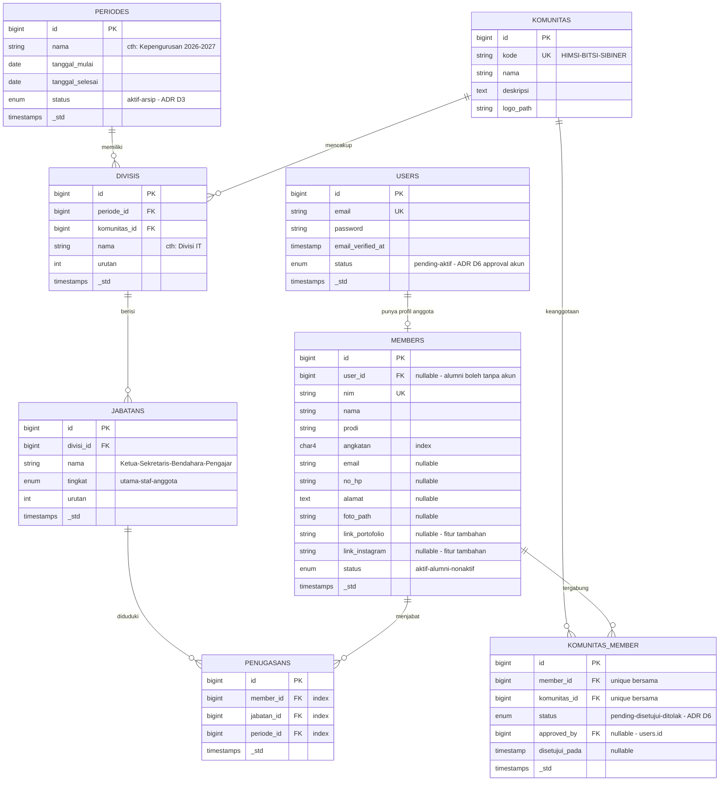
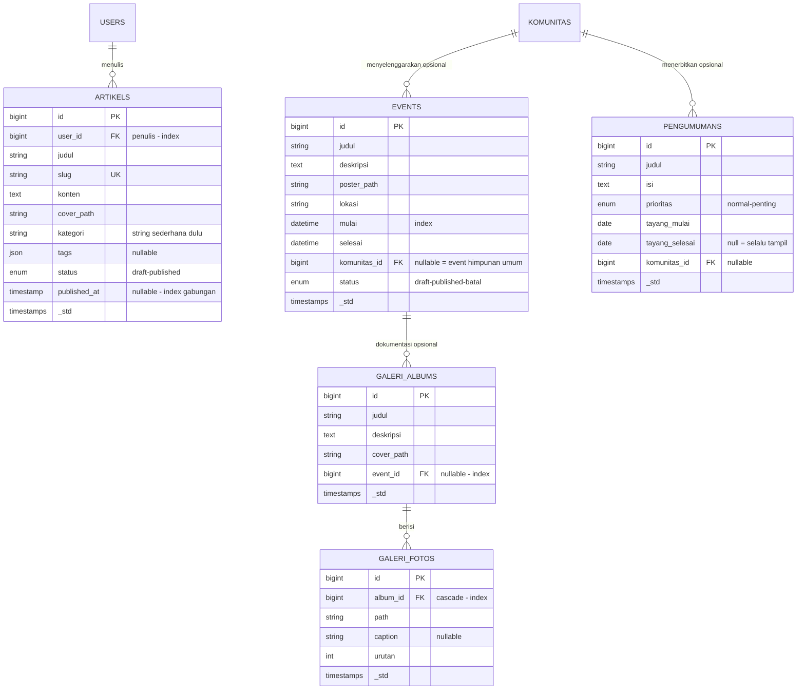
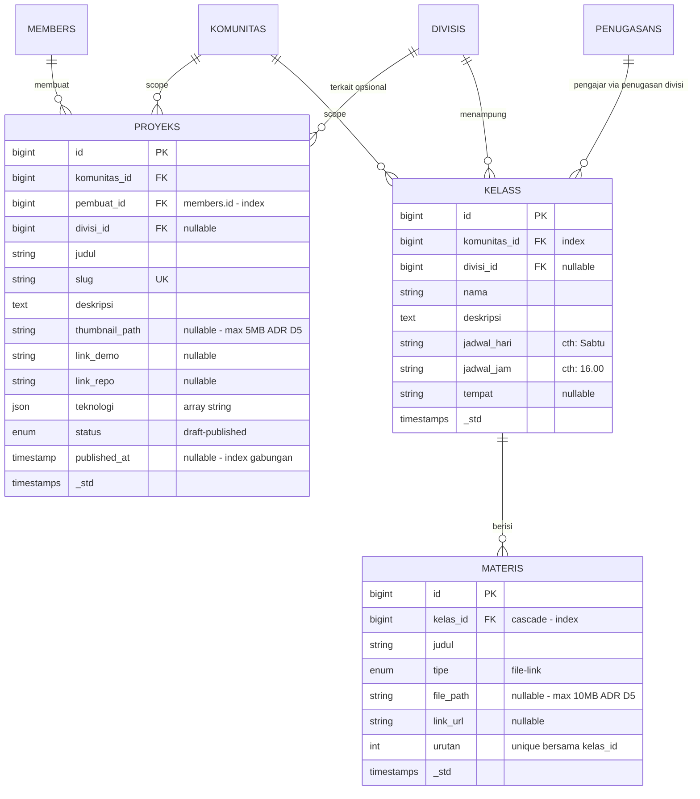

# ERD — Backend API Website HIMSI UMKU

> Status: Draft v1 · Tanggal: 2026-08-25 · Sumber: PRD v1.2 (`docs/prd/backend-api.md`)
> Database: SQL (relasional) · Skema dinormalisasi ke 3NF · Semua tabel punya `timestamps`

---

## 1. Diagram — Identitas & Struktur Organisasi



## 2. Diagram — Konten Publik



## 3. Diagram — Administrasi (Rapat · Surat · Keuangan)

```mermaid
erDiagram
    RAPATS ||--o{ RAPAT_MEMBER : "dihadiri"
    MEMBERS ||--o{ RAPAT_MEMBER : "presensi"
    PERIODES ||--o{ SURATS : "mengarsipkan"
    SURAT_TEMPLATES ||--o{ SURATS : "menomori"
    SURATS ||--o{ SURAT_STATUS_LOGS : "alur status tercatat"
    PERIODES ||--o{ KAS : "membukukan"
    KAS_KATEGORIS ||--o{ KAS : "mengklasifikasi"
    IURANS ||--o{ IURAN_MEMBER : "ditagihkan"
    MEMBERS ||--o{ IURAN_MEMBER : "membayar"
    KAS |o--o| IURAN_MEMBER : "tercatat sbg transaksi"

    RAPATS {
        bigint id PK
        string judul
        date tanggal "index"
        time jam_mulai "baru"
        time jam_selesai "nullable baru"
        string tempat "atau link online"
        text agenda
        text notulen "nullable"
        string lampiran_path "nullable baru"
        bigint komunitas_id FK "nullable baru - scope"
        string qr_secret "baru - ADR D1 rotasi 60d dihitung HMAC tanpa write DB"
        enum status "dijadwalkan-selesai-dibatalkan"
        bigint user_id FK "pembuat"
        timestamps _std
    }

    RAPAT_MEMBER {
        bigint id PK
        bigint rapat_id FK "cascade"
        bigint member_id FK "cascade"
        enum kehadiran "hadir-tidak-izin - upgrade dari boolean"
        string catatan "nullable"
        timestamps _std
    }

    SURATS {
        bigint id PK
        bigint periode_id FK "index"
        bigint surat_template_id FK "nullable utk surat masuk"
        enum jenis "masuk-keluar"
        string nomor_surat "auto dari template - unique per periode"
        date tanggal_surat "index gabungan dgn jenis"
        string pihak "pengirim masuk / tujuan keluar"
        string perihal
        string file_path "scan-PDF - max 10MB ADR D5"
        text disposisi "nullable"
        enum status "draft-review-disetujui-terkirim - hanya keluar"
        bigint created_by FK "users.id"
        timestamps _std
    }

    SURAT_TEMPLATES {
        bigint id PK
        bigint periode_id FK
        string nama_jenis "proposal-undangan-sp-sertifikat"
        string format "{urut}/HIMSI/UMKU/{romawi}/{tahun}" placeholder
        int counter
        timestamps _std
    }

    SURAT_STATUS_LOGS {
        bigint id PK
        bigint surat_id FK "cascade"
        enum status "draft-review-disetujui-terkirim"
        string catatan "nullable"
        bigint user_id FK "siapa yang mengubah - US-19"
        timestamps _std
    }

    KAS {
        bigint id PK
        date tanggal "index"
        enum tipe "pemasukan-pengeluaran"
        decimal12_2 nominal "BARU - fix audit PRD"
        bigint kas_kategori_id FK "baru"
        bigint periode_id FK "baru - index gabungan"
        string keterangan
        string bukti_path "nullable baru - foto nota"
        bigint member_id FK "nullable - siapa terkait"
        bigint user_id FK "pencatat"
        timestamps _std
    }

    KAS_KATEGORIS {
        bigint id PK
        string nama "iuran-sponsor-konsumsi-dll"
        enum tipe_default "pemasukan-pengeluaran"
    }

    IURANS {
        bigint id PK
        string nama "cth: Kas Bulanan Feb"
        decimal12_2 jumlah
        bigint periode_id FK
        bigint komunitas_id FK "nullable"
        date tenggat
        timestamps _std
    }

    IURAN_MEMBER {
        bigint id PK
        bigint iuran_id FK "cascade"
        bigint member_id FK "cascade - unique bersama"
        enum status "belum-lunas"
        bigint kas_id FK "nullable - bukti pembayaran"
        timestamp lunas_pada "nullable"
        timestamps _std
    }
```

---

## 4. Diagram — Showcase Karya & Kelas-Materi (M11–M12)



> Pengajar kelas = anggota dengan **penugasan** pada divisi terkait (mis. Ketua Divisi) — tidak ada kolom `pengajar_id` langsung agar mengikuti sistem penugasan dinamis (lihat `struktur-organisasi.md` §4). Modul ini dipakai ulang Sibiner dengan label "Sesi & Rangkuman" — endpoint sama, `komunitas_id` berbeda.

---

## 5. Tabel Ringkas Entitas, Relasi & Index

| Entitas | Atribut kunci | Relasi utama | Index yang direkomendasikan |
|---|---|---|---|
| `users` | email (UK) | 1—0..1 members | unique email |
| `members` | nim (UK), status, angkatan, portofolio & IG | 1—N penugasan · 1—N komunitas_member · 1—N rapat_member · 1—N iuran_member | unique `nim`; idx `(status)`; idx `(angkatan)`; idx `user_id` |
| `periodes` | status aktif/arsip | 1—N divisis, surats, kas, iurans | partial idx `status` |
| `komunitas` | kode UK | 1—N divisis, events, komunitas_member | unique `kode` |
| `divisis` | nama, urutan | N—1 periodes · N—1 komunitas · 1—N jabatans | idx `(periode_id, komunitas_id)` |
| `jabatans` | nama, tingkat | N—1 divisis · 1—N penugasans | idx `divisi_id` |
| `penugasans` | — | N—1 members/jabatans/periodes | idx masing-masing FK; cek unik `(member_id, jabatan_id, periode_id)` |
| `komunitas_member` | status approval | N—1 members · N—1 komunitas | **unique `(member_id, komunitas_id)`** |
| `artikels` | slug (UK), status, published_at | N—1 users | idx `(status, published_at)` |
| `events` | mulai/selesai | N—1 komunitas · 1—N galeri_albums | idx `mulai`; idx `komunitas_id` |
| `galeri_albums` / `fotos` | urutan | N—1 events · 1—N fotos | idx `event_id`; idx `album_id` |
| `pengumumans` | prioritas, masa tayang | N—1 komunitas | idx `(tayang_mulai, tayang_selesai)` |
| `rapats` | qr_secret, status | 1—N rapat_member · N—1 komunitas | idx `(tanggal, komunitas_id)`; unique `qr_secret` |
| `rapat_member` | kehadiran | N—1 rapats/members | unique `(rapat_id, member_id)` |
| `surats` | nomor (UK/periode), jenis | N—1 periodes/templates/users | unique `(nomor_surat, periode_id)`; idx `(jenis, tanggal_surat)` |
| `surat_templates` | format, counter | N—1 periodes · 1—N surats | idx `(periode_id, nama_jenis)` |
| `kas` | **nominal DECIMAL(12,2)** | N—1 periodes/kategoris/members/users | idx `(periode_id, tipe)`; idx `tanggal` |
| `iurans` / `iuran_member` | jumlah, tenggat, status | 1—N iuran_member | unique `(iuran_id, member_id)` |
| `proyeks` | slug (UK), status, teknologi JSON | N—1 komunitas/members/divisis | idx `(komunitas_id, status)`; idx `pembuat_id` |
| `kelass` | jadwal rutin hari/jam | N—1 komunitas/divisis · 1—N materis | idx `(komunitas_id, divisi_id)` |
| `materis` | tipe file/link, urutan sesi | N—1 kelass | unique `(kelas_id, urutan)` |

---

## 6. Catatan Normalisasi

**Skema normal (3NF):** semua entitas di atas memenuhi 3NF — tidak ada repeating group, tidak ada partial/transitive dependency. Kolom `jabatan` string di tabel `members` lama adalah pelanggaran klasik (data jabatan tergantung konteks periode, bukan properti orang) → dipindah ke tabel `penugasans`.

**Denormalisasi sadar (dan kenapa ditunda):**

| Kandidat | Alternatif denormalisasi | Keputusan |
|---|---|---|
| Saldo kas | Kolom cache `saldo` di periodes | ❌ Hitung via `SUM(nominal) GROUP BY periode_id` dengan idx `(periode_id, tipe)` — volume data organisasi kecil, query tetap < ms. Cache nanti kalau terbukti lambat |
| Rekap kehadiran | Kolom `total_hadir` di members | ❌ Agregasi on-demand per rekap; tidak perlu sinkronisasi |
| Counter nomor surat | — | ✅ Sudah denormalisasi by-design di `surat_templates.counter` (ADR D4) karena harus atomik per jenis |

> 💡 Learning: Aturan praktis — normalisasi dulu sampai benar, denormalisasi hanya saat ada *bukti* performa bermasalah. Data organisasi mahasiswa (ribuan baris/tahun) jauh dari ambang itu.

---

## 7. Rencana Refactor Tabel Existing (expand-contract aman)

Semua perubahan **non-destructive** (tanpa drop data):

| Tabel | Perubahan | Strategi |
|---|---|---|
| `members` | + `user_id` (FK nullable), `prodi`, `foto_path`, `link_portofolio`, `link_instagram`; − `jabatan` (string) | Add nullable dulu → backfill → migrasi nilai `jabatan` lama ke tabel `penugasans` → baru drop kolom (contract step) |
| `kas` | + `nominal` DECIMAL(12,2), `kas_kategori_id`, `periode_id`, `bukti_path` | ⚠️ `nominal` wajib NOT NULL tapi data existing belum punya → add nullable, backfill (konfirmasi data lama), lalu constrain. Tanpa ini laporan keuangan mustahil dibuat |
| `rapat_member` | `hadir` boolean → `kehadiran` enum(hadir/tidak/izin) | Add kolom baru, backfill (`true`=hadir, `false`=tidak), drop lama |
| `rapats` | + `jam_mulai`, `jam_selesai`, `komunitas_id`, `qr_secret`, `lampiran_path` | Pure addition, aman langsung |

Tabel baru: `periodes`, `komunitas`, `divisis`, `jabatans`, `penugasans`, `komunitas_member`, `artikels`, `events`, `galeri_albums`, `galeri_fotos`, `pengumumans`, `surats`, `surat_templates`, `kas_kategoris`, `iurans`, `iuran_member`, `proyeks`, `kelass`, `materis`.

---

*Lanjutan natural:* generate migration Laravel dari ERD ini (`coding migrate`) → API spec (`design api-spec`).
